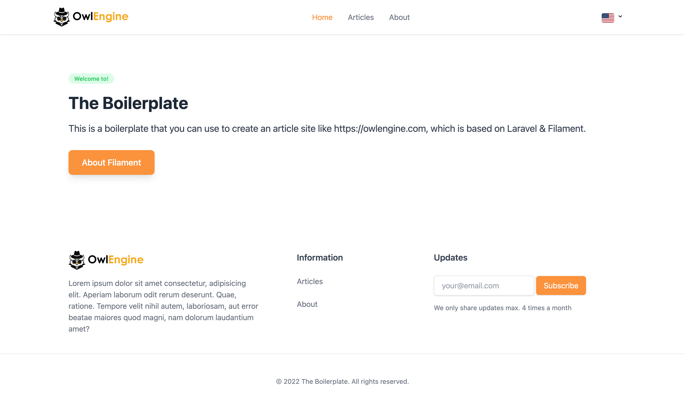
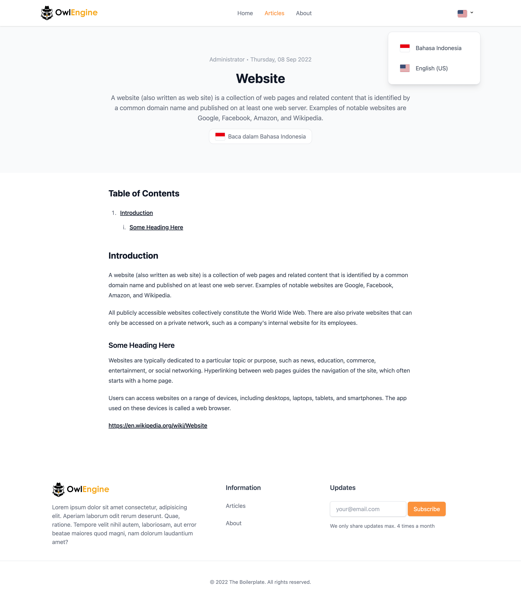
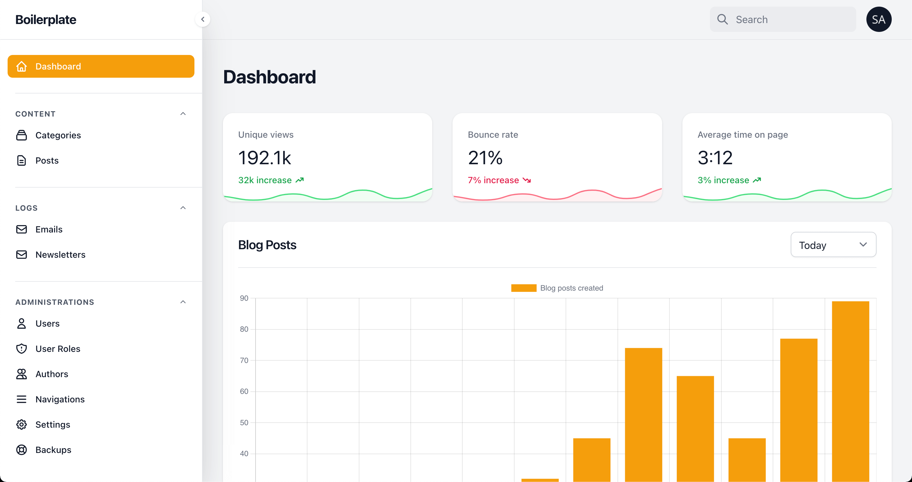
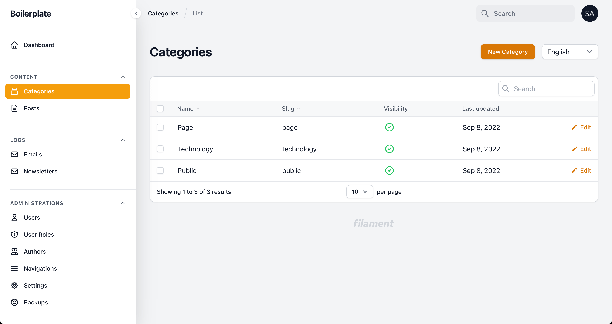
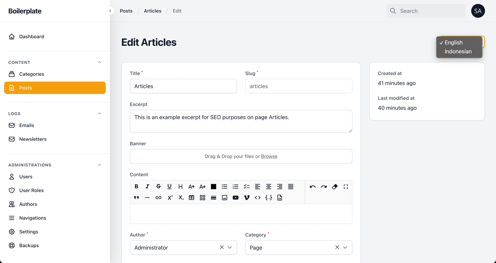
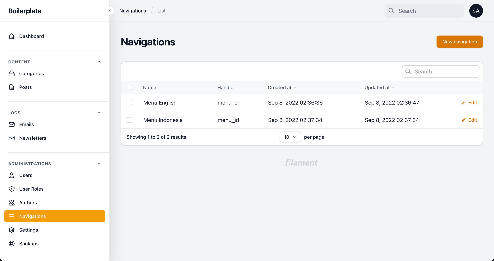
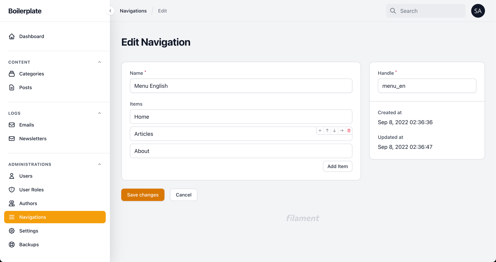
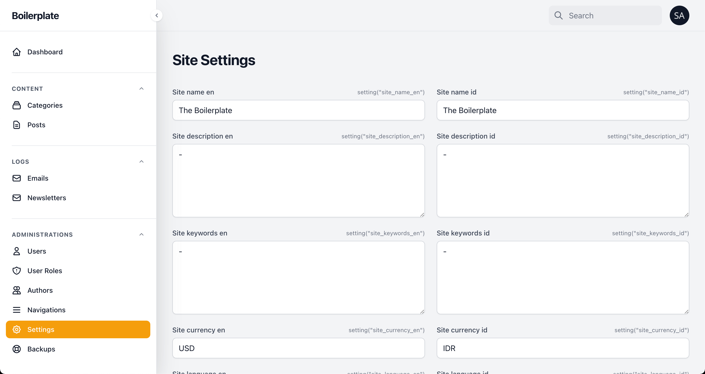
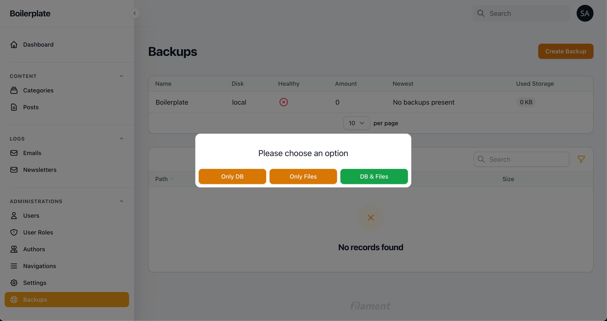

# Boilerplate

> Documentation will be here

# Installing dependencies
composer install

# Fresh install
php artisan migrate
php artisan make:filament-user
php artisan serve

# Using pre-filled data
mysql -u root -p YOUR_DATABASE < pre-filled-data.sql

# Creating sitemap and route redirection
php artisan sitemap:generator
php artisan cache:clear

# For development purposes
npm install
npm run watch

# Includes

https://github.com/laravel/framework v9.0
https://github.com/filamentphp/filament v2.0
https://github.com/filamentphp/spatie-laravel-settings-plugin v2.0
https://github.com/filamentphp/spatie-laravel-tags-plugin v2.15
https://github.com/filamentphp/spatie-laravel-translatable-plugin v2.0
https://github.com/spatie/laravel-tags v4.3
https://github.com/spatie/laravel-translatable v6.0
https://github.com/spatie/laravel-translation-loader v2.7
https://github.com/artesaos/seotools v0.22.1
https://github.com/awcodes/filament-tiptap-editor v0.3.12
https://github.com/ramnzys/filament-email-log v0.2.2
https://github.com/ryangjchandler/filament-navigation v0.3.0
https://github.com/shuvroroy/filament-spatie-laravel-backup v1.2

# Screenshots

||||
|:---:|:---:|:---:|
|Homepage|Detail Article|Dashboard|
||||
|Categories|Article Editor|Navigation|
||||
|Navigation Editor|Site Settings|Site Backup|
